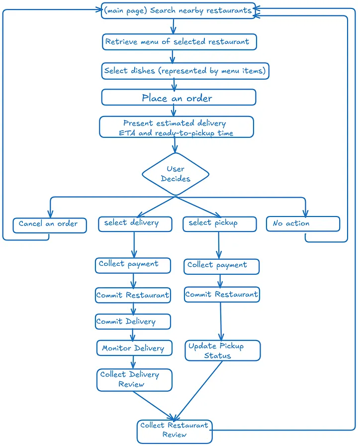
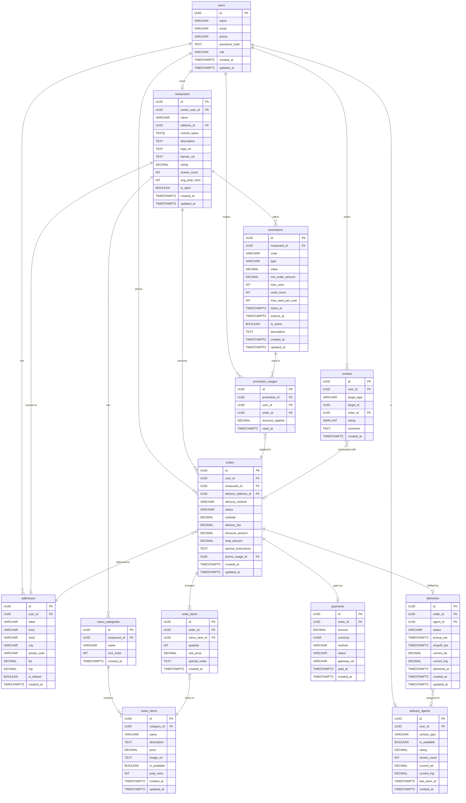

# ShopeeFood Clone

This is a clone of the ShopeeFood application, built to demonstrate the functionality and features of a food delivery platform. The project includes user authentication, restaurant listings, menu browsing, order placement, and payment processing.

## Functional Requirements
- Users should find nearby restaurants.
- Users should browse the menu of the selected restaurant.
- Users should be able to place an order and pay.
- Users should be able to select the method of delivery (pick-up or delivered).
- Users should be able to track order delivery in real-time.
- Restaurants should manage their menus and handle an order.
- Delivering agents should be able to accept or reject a delivery request.

## System Flow


## Domain Model

### Entities

| Entity | Description |
|---|---|
| `User` | Customer registered on the platform |
| `Restaurant` | A food establishment offering a menu |
| `MenuCategory` | Logical grouping of items (e.g., Burgers, Sides, Drinks) |
| `MenuItem` | A single dish or product on a menu |
| `Cart` | Ephemeral session holding a user's pending selections |
| `Order` | A confirmed purchase from a single restaurant |
| `OrderItem` | A line item within an order (MenuItem + quantity) |
| `Payment` | Payment record tied to an order |
| `Delivery` | The logistics record for a delivered order |
| `DeliveryAgent` | A person or autonomous vehicle making deliveries |
| `Review` | Customer rating and comment for a restaurant or agent |
| `Address` | A stored location (lat/lng + human-readable) |
| `Promotion` | A discount rule (promo code or automatic) scoped to a restaurant or platform-wide |
| `PromotionUsage` | Audit record tying a specific promotion redemption to a user and an order |

### Key Relationships

- A `User` places many `Orders`
- An `Order` belongs to one `Restaurant` and contains many `OrderItems`
- Each `OrderItem` references one `MenuItem`
- An `Order` has one `Payment` and one `Delivery`
- A `Delivery` is fulfilled by one `DeliveryAgent`
- A `Restaurant` has many `MenuCategories`, each with many `MenuItems`
- A `User` has many saved `Addresses`
- A `Promotion` belongs to one `Restaurant` (or is platform-wide when `restaurant_id` is null)
- A `PromotionUsage` links one `Promotion` to one `User` and one `Order`, recording the discount applied

---

## ERD Diagram



## API Design

All endpoints are versioned under `/api/v1/`. Communication uses **REST over HTTP/2** with JSON payloads. Authentication is via **Bearer JWT** in the `Authorization` header. Responses use standard HTTP status codes.

---

### Auth

| Method | Endpoint | Description |
|---|---|---|
| `POST` | `/auth/register` | Register a new user |
| `POST` | `/auth/login` | Obtain access + refresh tokens |
| `POST` | `/auth/refresh` | Rotate access token |
| `POST` | `/auth/logout` | Invalidate refresh token |

**POST /auth/login**
```json
// Request
{ "email": "jane@example.com", "password": "••••••••" }

// Response 200
{
  "access_token": "eyJ...",
  "refresh_token": "eyJ...",
  "expires_in": 3600
}
```

---

### Restaurants

| Method | Endpoint | Description |
|---|---|---|
| `POST` | `/restaurants/_search` | Search nearby restaurants |
| `GET` | `/restaurants/{id}` | Get restaurant details |
| `GET` | `/restaurants/{id}/menu` | Get full menu |
| `POST` | `/restaurants` | Create restaurant (owner) |
| `PUT` | `/restaurants/{id}` | Update restaurant info (owner) |

**POST /restaurants/_search**
```json
// Request body
{
  "lat": 40.7128,
  "lng": -74.0060,
  "radius_km": 5,
  "cuisine": "burgers",
  "sort_by": "rating",     // rating | distance | delivery_time
  "cursor": null,
  "limit": 20
}

// Response 200
{
  "data": [
    {
      "id": "uuid",
      "name": "Shake Shack",
      "rating": 4.7,
      "distance_km": 0.8,
      "avg_prep_mins": 12,
      "cuisine_types": ["burgers", "american"],
      "logo_url": "https://cdn.fastbite.io/..."
    }
  ],
  "next_cursor": "eyJpZCI6..."
}
```

**GET /restaurants/{id}/menu**
```json
// Response 200
{
  "restaurant_id": "uuid",
  "categories": [
    {
      "id": "uuid",
      "name": "Burgers",
      "items": [
        {
          "id": "uuid",
          "name": "Double Smash",
          "description": "Two smashed patties, American cheese, pickles",
          "price": 12.99,
          "image_url": "https://cdn.fastbite.io/...",
          "is_available": true,
          "prep_mins": 8
        }
      ]
    }
  ]
}
```

---

### Orders

| Method | Endpoint | Description |
|---|---|---|
| `POST` | `/orders` | Place an order (reserve items) |
| `GET` | `/orders/{id}` | Get order details |
| `GET` | `/orders` | List user's order history |
| `PUT` | `/orders/{id}/cancel` | Cancel an order (before confirmed) |
| `PUT` | `/orders/{id}/payment` | Submit payment (checkout) |
| `PUT` | `/orders/{id}/status` | Update order status (restaurant/agent) |

**POST /orders**
```json
// Request
{
  "restaurant_id": "uuid",
  "delivery_method": "delivery",
  "delivery_address_id": "uuid",
  "items": [
    { "menu_item_id": "uuid", "quantity": 2, "special_notes": "No onions" }
  ],
  "special_instructions": "Leave at door"
}

// Response 201
{
  "order_id": "uuid",
  "subtotal": 25.98,
  "delivery_fee": 2.99,
  "total_amount": 28.97,
  "status": "pending",
  "expires_at": "2026-06-23T18:05:00Z"  // payment window
}
```

**PUT /orders/{id}/payment**
```json
// Request
{
  "method": "card",
  "payment_token": "tok_visa_xxxx"   // tokenized by client-side SDK (e.g. Stripe.js)
}

// Response 200
{
  "payment_id": "uuid",
  "status": "captured",
  "order_status": "confirmed",
  "delivery_id": "uuid"
}
```

---

### Deliveries & Real-Time Tracking

| Method | Endpoint | Description |
|---|---|---|
| `GET` | `/deliveries/{id}` | Get delivery snapshot |
| `GET` | `/deliveries/{id}/stream` | SSE stream for live location updates |
| `PUT` | `/deliveries/{id}/location` | Agent posts GPS update |
| `PUT` | `/deliveries/{id}/status` | Agent updates delivery status |

**GET /deliveries/{id}/stream** — Server-Sent Events
```
Content-Type: text/event-stream
Cache-Control: no-cache
Connection: keep-alive

data: {"status":"assigned","agent":{"name":"Carlos","rating":4.9},"eta":"2026-06-23T18:22:00Z","lat":40.7110,"lng":-74.0055}

data: {"status":"picked_up","lat":40.7105,"lng":-74.0048,"eta":"2026-06-23T18:18:00Z"}

data: {"status":"delivered","delivered_at":"2026-06-23T18:17:43Z"}
```

**PUT /deliveries/{id}/location** (called by agent app, ~1 Hz)
```json
// Request
{
  "lat": 40.7105,
  "lng": -74.0048,
  "heading": 180,
  "speed_kmh": 22,
  "timestamp": "2026-06-23T18:15:30Z"
}
// Response 204 No Content
```

---

### Reviews

| Method | Endpoint | Description |
|---|---|---|
| `POST` | `/reviews` | Submit a review |
| `GET` | `/restaurants/{id}/reviews` | List restaurant reviews |
| `GET` | `/agents/{id}/reviews` | List agent reviews |

---

### Promotions

| Method | Endpoint | Description |
|---|---|---|
| `POST` | `/promotions/validate` | Validate a promo code before checkout |
| `GET` | `/restaurants/{id}/promotions` | List active promotions for a restaurant |
| `POST` | `/promotions` | Create a promotion (restaurant owner / admin) |
| `PUT` | `/promotions/{id}` | Update a promotion |
| `DELETE` | `/promotions/{id}` | Deactivate a promotion |

**POST /promotions/validate**
```json
// Request
{
  "code": "SAVE20",
  "restaurant_id": "uuid",
  "order_subtotal": 35.00
}

// Response 200 — valid
{
  "promotion_id": "uuid",
  "type": "percentage",
  "value": 20.0,
  "discount_amount": 7.00,
  "description": "20% off your order",
  "expires_at": "2026-07-31T23:59:59Z"
}

// Response 422 — invalid
{
  "error": "PROMO_MIN_ORDER_NOT_MET",
  "message": "Minimum order of $50.00 required for this code.",
  "min_order_amount": 50.00
}
```

Possible error codes: `PROMO_NOT_FOUND`, `PROMO_EXPIRED`, `PROMO_MAX_USES_REACHED`, `PROMO_ALREADY_USED`, `PROMO_MIN_ORDER_NOT_MET`, `PROMO_WRONG_RESTAURANT`.

---

### Agent & Restaurant Management

| Method | Endpoint | Description |
|---|---|---|
| `PUT` | `/agents/me/availability` | Toggle agent online/offline |
| `GET` | `/agents/deliveries/pending` | List pending delivery requests near agent |
| `PUT` | `/agents/deliveries/{id}/accept` | Accept a delivery |
| `PUT` | `/agents/deliveries/{id}/reject` | Reject a delivery |
| `GET` | `/restaurants/me/orders` | Restaurant's incoming orders |
| `PUT` | `/restaurants/me/orders/{id}/accept` | Accept order with prep time |
| `PUT` | `/restaurants/me/orders/{id}/reject` | Reject order |

---


---
